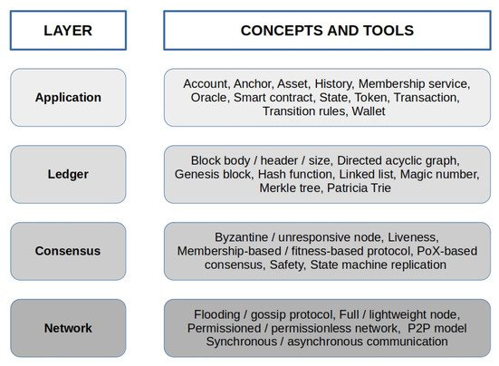

# DLT Reference Architecture and Building Blocks

Although DL systems vary significantly in their implementations, they share a typical reference architecture and some key concepts and technologies that give rise to their building blocks. We will use this reference architecture in the present section to overview the main characteristics of techniques and the cryptographic concepts and mechanisms that enforce such features. Moreover, we will use the scheme as a map to place concepts discussed in the following sections in the right place for the system. **Figure 3** illustrates the four-layer architecture that virtually characterizes any DL system. The _application layer_ defines the types of users involved in the systems and how they can interact with them, offering a suite of concepts and tools that can vary depending on the specific platform considered. The _ledger layer_ encompasses all the data structures and mechanisms which give rise to the ledger. Some of them, such as linked lists and Merkle trees, make the ledger data structure, while others enforce consensus or keep track of objects and workflows managed at the application layer. The _consensus layer_ concerns the components of the multiparty agreement protocol used to select a unique ledger among possible diverse instances, thus assuring its consistent state. Finally, the _network layer_ has to do with how the peer-to-peer (P2P) network of nodes is built and shares information so that the ledger can be queried and managed, and a node can always get its updated state.

**Figure 3.** A DLT reference architecture.
