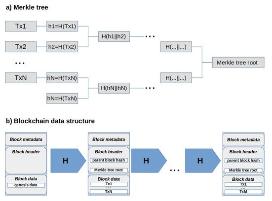

# Ledger

Introduced in MGN, the blockchain is a tamper-proof, append-only data structure consisting of a linked list of transaction blocks. The key concept at the basis of the blockchain data structure is a _collision-resistant hash function_ \[**26**]. Haber and Stornetta, in 1990 \[**10**], introduced lists of messages linked by (including in the current message) the hash digest of the previous one. The authors consider the linkage of digital certificates issued by a timestamping service as a countermeasure to back-date or forward-date a digital document by the owner, even with a colluding service. In Mangosteen, however, the hash function is used in the context of _Merkle trees_, a kind of binary tree for efficiently checking the integrity or authenticity of a set of data \[**10**]. Transactions get grouped in ordered blocks, and each transaction in a block is associated with its hash digest, thus resulting in the tree’s leaves. Left and right hash strings are then recursively joined and hashed again to get the digest value for their parent node in the tree until the tree root (**Figure 4**, sketch (a)). This way, the hash value associated with the Merkle root uniquely represents the ordered block of transactions with overwhelming probability. Such string is then inserted, along with the hash digest of the header of the previous block, in the header of the current block for reference to realize the blockchain data structure (**Figure 4**, sketch (b)).

**Figure 4.** (**a**) Merkle tree construction for an odd number _N_ of transactions, in which case the last hash digest gets duplicated to get a balanced tree, and; (**b**) The linked list of blocks starting from the genesis block, which results in the blockchain data structure. In both cases, _H_ denotes a collision-resistant hash function.

Like a physical chain, a blockchain can be resistant to tampering but only provided that its links are sufficiently robust, i.e., difficult to replace with new ones. Assuming that an attacker cannot alter a given block (a digital signature on the block fulfills this assumption, giving rise to the linked list of digital certificates introduced in \[**10**]), the collision-resistance property peculiar of the hash function makes it hard to alter any other previous block in the chain. However, since hash functions are efficiently computable, a given blockchain could be built from scratch starting from its initial (_genesis_) block, with any modification in its subsequent blocks as required by the attacker (_a long-range_ attack). The critical idea in Bitcoin was to make the construction of a new block relatively tricky, thanks to a kind of cryptographic challenge introduced for anti-spam purposes in \[**12**]. The resulting proof-of-work is a component of the Nakamoto consensus, and as such, we will briefly discuss it in **Section 3.3**.

### 1. Block Structure

Although sketch (b) in **Figure 4** is a reference model for all blockchain-based systems, the exact structure of a block can vary considerably from system to system, according to the functionalities and workflows of the application layer and the (one or more) consensus protocol supported. For example, the block header in Hyperledger Fabric contains just three records storing the block number, the parent block hash, and the current block hash, which is the Merkle tree root of the transactions recorded in the block data. In turn, each transaction is composed of its header, signature, proposal, response, and endorsements fields. Things are very different in Ethereum, where a block’s header is a data structure consisting of 14 fields, and a transaction consists of 7 fields. We illustrate the differences between these two systems in **Table 1** for block headers and in **Table 2** for transactions. These differences ultimately reflect the different nature of permissionless and permissioned systems concerning the management of decentralized computations.

**Table 1.** Fields composing the block header in Hyperledger Fabric (HLF) and Ethereum (ETH).

**Table 2.** Fields composing a transaction in Hyperledger Fabric (HLF) and Ethereum (ETH).

Hyperledger Fabric is a consortium-oriented system whose primary goal is to support the reliable execution of business processes involving a small number of collaborating parties, among which there are no implicit relationships of trust. In this platform, there is a clear distinction among who is in charge of controlling the correct execution of the business process and who has to build the blockchain accordingly. An _endorsement policy_, a boolean expression defined to fulfill the use case-specific trust requirements, encodes the identities of a set of nodes called _endorsers_ and their respective approvals or disapproval contribution to the final decision when checking a transaction proposal. Endorsement is also at the basis of the collaborative development and management of _chaincode_, the program in the form of transactions to be registered on the ledger, logically organized in smart contracts. Instead, a separate set of nodes called _orderers_ is in charge of ordering in blocks the endorsed transactions and registering such blocks in the ledger. Unlike endorsers, orderers use an appropriate consensus protocol to agree with a majority on transactions ordering within a block and blocks ordering within the blockchain. In both cases, however, the decision of a node is expressed thanks to its digital signature, each final decision involves a limited number of nodes, and final decisions are reached through the definitive collection of their respective preferences and cannot change at later times. This design turns out in a simple block header without all the fields concerning the consensus protocol, whereas a transaction provides the fields to enforce the endorsement policy. The advantages of the “endorser-orderer” approach compared to those traditionally adopted in blockchain systems are discussed in **Section 4**.

Ethereum follows an entirely different approach since its permissionless nature does not distinguish nodes based on specific roles: all nodes are potentially in charge of validating transaction proposals and ordering valid transactions in blocks to be registered on the blockchain. Due to the vast number of nodes involved in the above task, the system needs implicit mechanisms to prevent denials of service by constraining the duration of each transaction and its repeated submission. The _gas_ concept and its related fields in both the block header and transaction data structures account for the first constraint, while the Nonce field in each transaction serves to ward off reply attacks. Implicit agreement mechanisms are also required to get consensus: the present running version of Ethereum relies on the proof-of-work _Ethash_ algorithm, so its block header comprises the fields required to implement it. In addition to the specific fields of the Ethash algorithm (e.g., Hash, Nonce, and Miner), the block header also provides the Uncles hash field to take into account the rule for consensus finalization, given that running Ethash can result in several simultaneously valid blocks (two more fields, Difficulty and Total difficulty, are provided in the Ethereum block data to account for Ethash and its finalization rule).

We must point out that the above macroscopic differences between Ethereum and Fabric blockchains also stem from two different approaches to modularity in software design. Fabric modularity is from scratch: consensus is implemented differently at the application and ledger layers, and we can opt among different possible protocols. Ethereum instead hard-codes consensus into incentives and computing resources, achieving modularity at the application layer through tokenization. As we will illustrate in **Section 4**, both platforms represent the cornerstone of general-purpose computing frameworks for decentralized applications, although for very different trust management models.

Although consensus finalization concerns more appropriately one of the characteristics of the protocols presented in **Section 3.3**, we will briefly discuss the existing alternatives to select the “official” chain here, since this can affect the structure of a block, as shown by the previous example. Furthermore, it may be helpful to spend a few more words on this point as people often misunderstand it, and in some systems, such as Bitcoin and Ethereum, it concerns the significant notion of “blockchain state” introduced in the previous section.

In Nakamoto’s paper \[**27**], there is some ambiguity about the rule for finalizing a block, which is called the “longest chain rule” but it is explicitly referred to as the chain of blocks starting from the genesis block that “has the greatest proof-of-work effort invested in it”. Following in a strict sense, the longest chain, as detailed, e.g., in \[**13**], is not safe when the consensus procedure exploits a difficulty target, as in proof-of-work and proof-of-stake protocols (see next section), since longer chains may exist that contain far less mining work. For example, Ref. \[**4**] describes two intriguing improvements to the _selfish mining_ attack introduced in \[**28**], which can be significantly advantageous for the attacker in catching up with the main official chain. In these systems, the correct method for selecting the current valid chain amongst the possible forks deriving from multiple block proposals is to compute the cumulative amount of work required to produce the chain. This fix was implemented early on in Bitcoin, which consists of the _heaviest chain rule_.

The _Greedy Heaviest Observed Subtree_ (GHOST) finalization protocol was proposed in 2013 by Vitalik Buterin for Ethereum \[**29**] to achieve a faster block proposal rate without incurring in too many _orphan_ blocks, i.e., valid blocks that eventually got cast off as a heavier chain achieved dominance. By allowing new blocks to reference multiple predecessors, a parent, and zero or more _uncles_, GHOST includes orphan blocks in the calculation of which chain has the greatest cumulative difficulty; moreover, it establishes that the miners of its uncles get a fraction of the base reward for a new block. This last rule helps to get fairer management of the efforts by honest nodes, protecting them against nodes (or pools thereof) that exploit their hashing power to create small blocks with only a fraction of the transactions heard over the network. The protocol currently implemented in Ethereum is not GHOST, as erroneously reported by many sources, but a variant that only implements the second rule: uncles do indeed receive a reward, but they do not count towards the total difficulty of a chain .

However, the Ethereum blockchain has all the fields required for the implementation of GHOST, and the choice not to implement it seems to be due only to the fact that the current protocol, although simpler, still allows for a three times transaction throughput (10–15 tx/s versus 3–5 tx/s) and a much shorter transaction confirmation mean time (about 1 min versus 10 min) when compared to Bitcoin, although the number of confirmations after which one can consider a transaction safely recorded into the ledger is six for Bitcoin but much more for Ethereum (according to \[**16**], one should wait for at least 7 confirmations, but major exchanges wait for around 50 confirmations to consider an Ethereum transaction complete). Nevertheless, after all, the designers of Ethereum are confident in the next _Serenity_ release for boosting efficiency and performance, as we are going to explain in **Section 3.3**.
