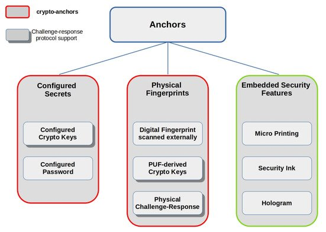

# Anchors

Assuring the authenticity of products or their components is fundamental for many industries, from aerospace to electronics, pharmaceuticals, and the food industry. Unnoticed, faked products, such as food, drugs, diagnostic tests, electronic components, hardware parts, and raw materials, pose a high risk of causing significant harm. Therefore, a related demand is to track and trace the logical and physical route, condition, and chain of custody or ownership of these goods throughout the supply chain and their lifecycle. Blockchain systems have built-in tamper-proof track and trace functionalities. However, a close link between physical objects and their digital representation is essential to avoid the _garbage-in, garbage-out_ issue, where a blockchain-managed digital asset is tied to and used to represent an inauthentic asset in the physical world.

Typically, a product is linked to a digital record through an alphanumeric string (e.g., the Global Trade Item Number (GTIN) \[**49**]) uniquely associated with the individual product or a class of products by model, batch, production site, manufacturer, or similar. This unique identifier (UID) is printed, embossed, or attached like a tag to the product or its packaging, and in many cases, it can be easily copied or transferred to a clone of the original product. UIDs by themselves cannot authenticate physical objects, also if they are cryptographically protected (e.g., authenticated), since they are not intrinsically tied to them in an unalterable way. What characterizes the authentication of a physical resource through alphanumeric data is indeed the following:

1. there must be a one-to-one unforgeable association between data items and resources, so that each data item corresponds to only one resource and vice versa, without any possible swapping or substitution in such correspondence;
2. the data item associated with the object must be authentic; that is, only the party who creates or holds the resource must be able to generate a valid data item representing it;
3. if a resource is subject to changes in its status (e.g., ownership, physical properties), then the one-to-one unforgeable association considered in (1) must guarantee a one-to-one correspondence with all the states that characterize the resource life cycle, thanks to an appropriate field in the data item.

We will refer to the above scheme as _authentic data encoding for physical resources_ (ADExPR). Keep in mind that property (1) and its optional extension (3) in turn requires the following two properties: (i) _non-clonability_ of the data items, and; (ii) _non-dissociability_ between a resource and its related data item. _Clonability_ refers to the fact that the data item for a given product can be reproduced (e.g., photocopied) and used for other products as well. _Dissociability_ refers to a tag that can be detached from the original product and used for a different product.

Suppose a watch manufacturer decided to claim the originality of its products through QR tags encoding data encrypted with the manufacturer’s private key that can be checked by customers knowing the related public key. Although the tag contains authentic data, it could be exposed to both cloning and detaching. For example, a standard QR tag encrypting solely the brand name can be copied multiple times and put on the packaging of faked watches. Moreover, a QR code produced with anti-cloning micro-printing technologies that encrypts the watch UID can fail in protecting its authenticity if it is printed or embossed on a physical medium that can be detached from the watch. These examples should clarify the gap between ADExPR and the classic notion of data authentication, along with the cryptographic tools to guarantee these last (i.e., message authentication codes and digital signatures).

An _anchor_ ties a UID to the physical object with a property of the object that is hard to clone, forge, and transfer to another object. Such a property may be inherent to the object, or it may be entangled (anchored) so that, if removed, it destroys the object, an object functionality, or the property itself. This way, the property enforces the requisites of non-clonability and non-dissociability and, provided that the creators or owners of the objects authentically generated UIDs, anchors result in an ADExPR scheme. If some part of the above encoding has to rely on a cryptographic tool (e.g., a digital signature to guarantee the authenticity of the source of origin for the UIDs), then the more specific term _crypto-anchor_ is often used.

In \[**17**], the classification for anchors depicted in **Figure 6** represents a starting point for the design of a blockchain-based _crypto-anchor platform_ ([**https://www.ibm.com/blockchain/solutions/transparent-supply**](https://www.ibm.com/blockchain/solutions/transparent-supply), accessed on 15 October 2021) recently described in \[**18**]. Deployed by IBM in collaboration with some leading vendors of crypto-anchor technologies, this platform supports application development ranging from sustainable sourcing to supply-chain management and consumer engagement.

**Figure 6.** A classification of anchors based on the mechanism used to implement the entanglement of the UID to the physical object (adapted from \[**17**]).

_Configured secrets_ are useful for electronic devices. A manufacturer, distributor, or owner can configure these to store a secret, such as a password or a private key. Public-key cryptography allows for a challenge–response protocol through which the device can prove its identity and thwart reply attacks. However, in both symmetric and asymmetric schemes, the secret might be retrieved by an adversary able to physically interact with the device or retained by the person who configured the device for being reused multiple times. Tamper-proof hardware and cryptographic protocols resilient to side-channel attacks can mitigate the first issue at the price of more expensive devices.

In some cases, storing a secret in a device can be avoided by exploiting physical patterns or behaviors uniquely attributable to that device. Uncontrollable and unpredictable slight variations in the structure of specific materials or the outcome of some production processes can indeed give rise to _physical fingerprints_, such as in the production of semiconductors (e.g., transistors) or the texture of a surface. The above variability can be an intrinsic side effect of manufacturing or introduced on purpose and externally, as in doping material with extraneous particles. Since the variations are uncontrollable, they cannot be duplicated, not even by the original manufacturer; moreover, their unpredictable nature can work as a source of randomness for the setup of cryptographic material, such as secret keys and nonces. However, in order to be eligible as fingerprints of a given set _S_ of objects, the physical variations affecting the objects in _S_ must be characterized in some analytical or statistical sense to be attributable only to the objects in _S_, in a way that any two different objects in _S_ give rise to two diverse variations. For example, the doping of semiconductors should be attributable to a unique manufacturer, semiconductor type, and semiconductor item. This circumstance means that the physical fingerprints for the objects in _S_ represent the values of a function defined on _S_ and injective therein, called _physical unclonable function_ (PUF) \[**50**].

_Embedded security features_ do not rely on cryptographic mechanisms, requiring instead an expensive application process such as micro-printing, hologram generation, or printing with a security ink (e.g., photosensitive ink that is visible to the naked eye but changes color or disappears when placed under a UV light). Anyone can read but not copy a tag produced in this way without special equipment. The difficulty and cost to reproduce an embedded security feature should deter most attackers; however, users often mistake false features for true ones unless they have special equipment for detecting fakes, as in the case of counterfeit banknotes.

An example of an anchor based on _embedded security features_ was the _ValiGate_ tag produced by _tesa scribos_, a company that until mid-2021 was part of _tesa group_ ([**https://www.tesa.com/en-in/about-tesa**](https://www.tesa.com/en-in/about-tesa), accessed on 7 July 2021). ValiGate looked like a normal QR-code but contained a data field protected with a dual encryption algorithm and printed thanks to a proprietary micro-printing technique, requiring a dedicated smartphone scanning app. In this case, encryption provided an authenticated source of origin, while micro-printing served to counteract cloning attacks by preventing a simple “scan and print” approach. A recent change of ownership of tesa scribos to _SCRIBOS_ ([**https://www.scribos.de/en**](https://www.scribos.de/en), accessed on 15 October 2021)—a subsidiary of the german _KURZ Group_ specialized in protecting brands with product markings and digital tools—introduced a new version of the Valigate tag removing special printing features, making it compatible with the world’s most widely available printing machines and not requiring dedicated scanning apps.

An alternative in the class of the _configured secrets_ is a special kind of signature patented by one of the authors \[**51**], which is only valid if the associated physical asset has a given status and gets univocally tied to a characteristic data set for the asset. In this case, the resilience to cloning is because a valid tag can be generated only by a source of authority (e.g., a product brand), and one or more data uniquely tied to the asset only get disclosed when the asset reaches a given status (e.g., when a product on sale gets sold).
